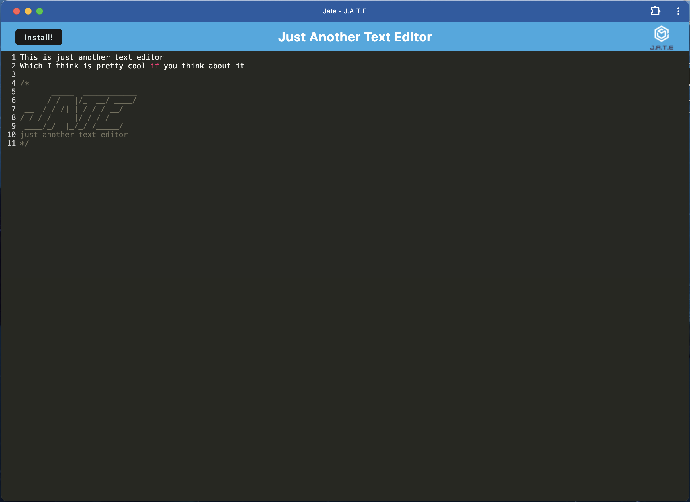

# pwa-text-editor

## Description

- The purpose of this week's challenge was to create an offline text editor app that can be used whenever and wherever! 

## Installation

- This application should look like the following image when installed properly

 

 All that is needed for installation is to click the "install" button, go to your downloads and finally click "jate" on downloads to download the app!

## Usage
- To use this application, simply type whatever you want such as notes, recipes, or cheatsheet codes.

  Deployed app link: https://pwa-text-editor-pv4e.onrender.com

  GitHub repository: https://github.com/noe-bee/pwa-text-editor

## Credits

N/A

## License

Refer to the license on the repository.

---
